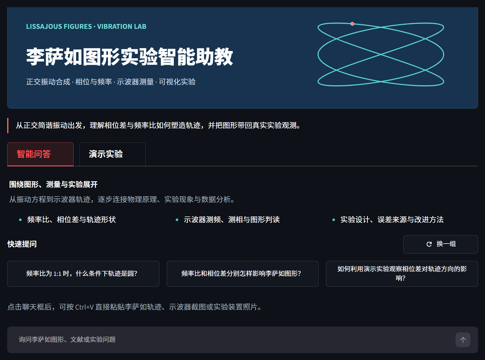
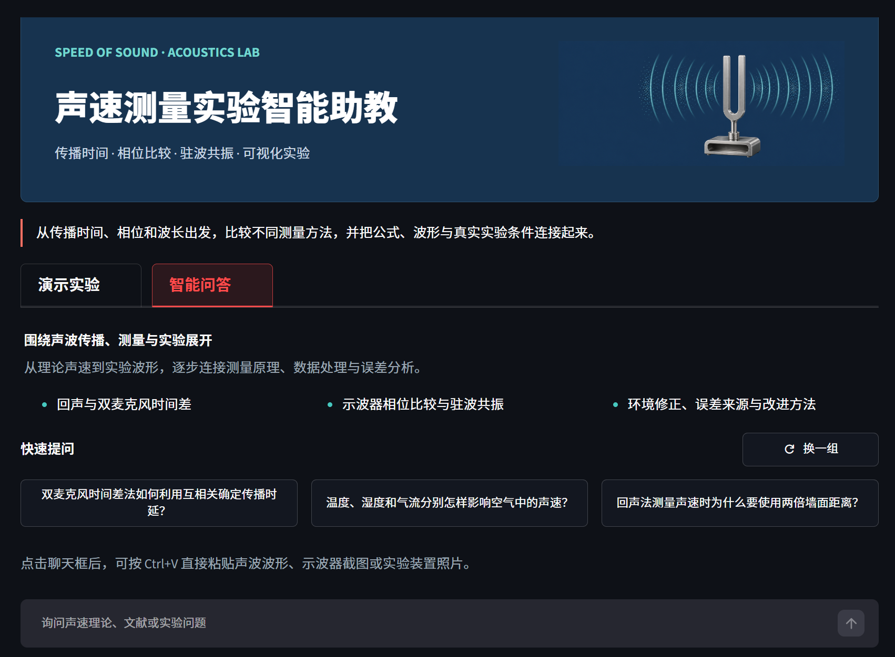
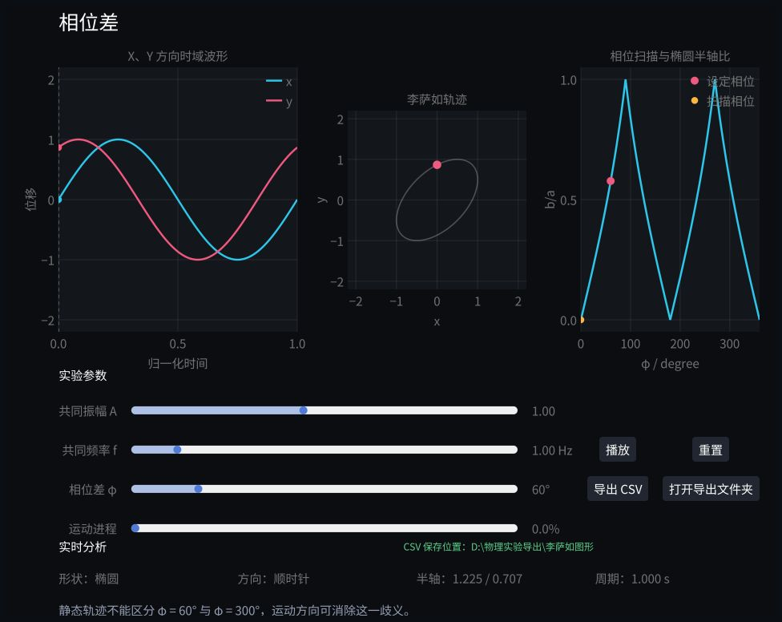
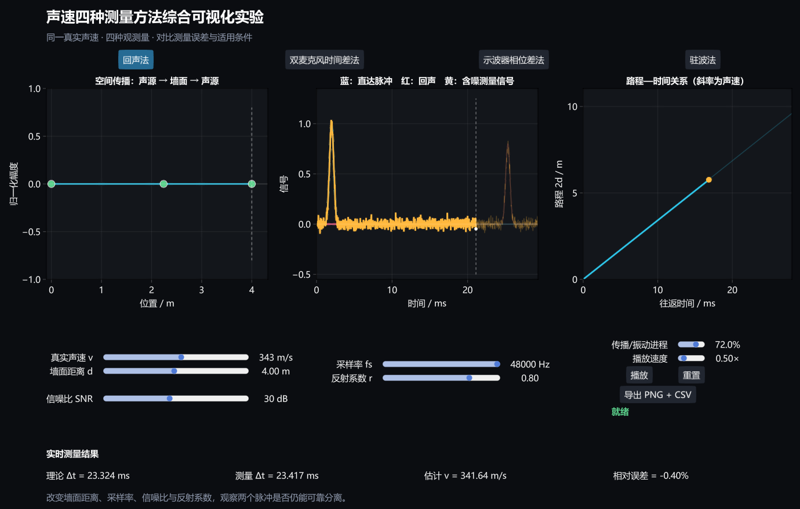
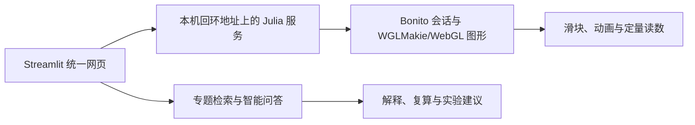

# 大学物理实验智能助教与虚拟仿真实验

> 第十二届全国大学生物理实验竞赛（创新）· 自选题 2：教学资源和虚仿

本仓库包含两个相互独立、技术架构一致的大学物理实验教学项目：

- **李萨如图形实验智能助教**：围绕正交简谐振动合成，研究相位差、振幅比、有理频率比和频率失谐；
- **声速测量实验智能助教**：在统一声速模型下比较回声法、双麦克风时间差法、示波器相位差法和驻波法。

两套作品都将专题智能问答、确定性物理计算和 Julia/WebGL 交互实验放在同一网页中。Python/Streamlit 负责知识库、问答、图片输入和应用生命周期；Julia/WGLMakie/Bonito 负责物理模型、交互控件和浏览器图形。正式 Windows 单文件版已经打包 Python 与 Julia 运行时，目标机无需另行安装开发环境。

## 项目一览

| 项目 | 交互实验 | 智能问答 | 正式验收（2026-08-13） |
| --- | --- | --- | --- |
| 李萨如图形 | 相位差、振幅比、有理频率比、频率失谐 | 轨迹、示波器截图与装置图片分析；专题文献检索；频率比、周期、面积等确定性复算 | 25/25 项测试通过；离线冒烟覆盖 Julia 5 条路由、6 项资源 |
| 声速测量 | 回声法、双麦克风时间差法、示波器相位差法、驻波法 | 波形、互相关曲线、驻波图和装置图片分析；专题文献检索；四种方法确定性复算 | 24/24 项测试通过；离线冒烟覆盖 Julia 1 条路由、2 项资源 |

## 真实界面

### 智能问答

| 李萨如图形 | 声速测量 |
| --- | --- |
|  |  |

### Julia 交互实验

| 李萨如图形 | 声速测量 |
| --- | --- |
|  |  |

## 核心特色

### 1. 智能问答与实验共用同一教学语境

- 由经典文献、现代研究资料和自研实验说明构建专题知识库；
- 使用字符级 TF-IDF 与 BM25 混合检索，可选稠密语义向量；
- 支持连续追问，以及 PNG、JPG、JPEG、WebP 图片输入；
- 参数完整时调用自研计算工具，模型不能用语言推测覆盖确定性结果；
- 模型接口不可用时仍保留本地检索、物理计算和 Julia 实验能力。

### 2. Python–Julia 混合编程



这里的“Julia 嵌入网页”不是把 Julia 代码编译成 JavaScript，也不是在 Python 进程中频繁交换大数组。启动器分别管理 Streamlit 与 Julia/Bonito 本机服务，Streamlit 组件通过内嵌框架显示 Julia 页面；实验滑块和图形状态直接在浏览器与 Julia 会话之间更新。

### 3. 可验证的物理模型

- Julia 实验输出原始离散序列、理论中间量、模拟测量量和反演结果，而不只是不可复算的动画；
- 界面读数、图形，以及项目中提供的数据导出使用同一轮计算结果；
- 智能问答负责解释和检索，实验数值始终由确定性模型产生；
- 两个专题都保留解析关系、自检、单元测试和单文件离线冒烟测试。

### 4. 核心物理关系

李萨如实验从正交简谐振动出发：

$$
x=A\sin(2\pi f_x t),\qquad
y=B\sin(2\pi f_y t+\varphi).
$$

声速专题则围绕不同可观测量比较四条反演链：

$$
v_{\mathrm{echo}}=\frac{2d}{\Delta t},\qquad
v_{\mathrm{mic}}=\frac{d\cos\theta}{\Delta t},
$$

$$
v_{\mathrm{phase}}=\frac{2\pi f d}{2\pi n+\varphi_w},\qquad
v_{\mathrm{standing}}=f\lambda=\frac{2fD_q}{q}.
$$

程序先用统一物理参数生成离散观测，再从延迟、相位或波节间距反演结果，避免在“测量”阶段直接读取预设真值。

### 5. 单文件生命周期管理

正式版为每个页面维护独立 UUID 和递增事件序号，可区分刷新、多标签页和真正关闭。最后一个页面关闭且连接消失后，程序保留约 20 秒重连宽限，随后回收 Streamlit、Julia 及其派生进程。Windows Job Object 负责异常退出兜底，隔离的浏览器配置目录和本次临时解包目录也会在边界检查后清理。

## 快速开始

### 方式 A：Windows 单文件版

目标机要求：

- 64 位 Windows 10/11；
- 支持 WebGL 的新版 Microsoft Edge、Google Chrome 或其他现代浏览器；
- 建议内存 8 GB 及以上；
- **无需安装 Python 或 Julia**。

双击对应 EXE 即可。首次运行需要解压内置 Python、Julia 与 WGLMakie 资源，启动时间会明显长于普通小型应用。Julia 服务使用的是内部本机端口，用户无需手工设置或单独访问。

当前本机验收版如下。`packaging/dist/` 被项目级 `.gitignore` 排除，因此这些 EXE **不在 GitHub 仓库中**；公开下载应在完成凭据复核后通过 GitHub Releases 提供。

| 项目 | 本地文件 | 大小 | SHA-256 |
| --- | --- | ---: | --- |
| 李萨如图形 | `李萨如图形实验智能助教_单文件版.exe` | 665,834,871 B（634.99 MiB） | `029ACBCDE2DA4B6D870CF82DB472C56ED59495D1467F1BF1439F674E3E6F044D` |
| 声速测量 | `声速测量实验智能助教_单文件版.exe` | 618,598,507 B（589.94 MiB） | `B21AE3CEE3F806ACFA434078729243FB440E44ACB530F28FCA446B29443187F2` |

下载 EXE 后可在 PowerShell 中校验：

```powershell
Get-FileHash -LiteralPath ".\应用文件.exe" -Algorithm SHA256
```

运行日志位于：

```text
%LOCALAPPDATA%\LissajousExperimentTutor\logs
%LOCALAPPDATA%\SoundSpeedExperimentTutor\logs
```

### 方式 B：从源码运行

制作与开发环境：Windows 10/11 x64、PowerShell、[uv](https://docs.astral.sh/uv/)、Python 3.12、Julia 1.10，以及支持 WebGL 的现代浏览器。

仓库中的 PDF、PPTX 和 MP4 使用 Git LFS：

```powershell
git lfs install
git clone https://github.com/RENAI-PHYSICS-AI/renai_physical_experiment_competition.git
Set-Location ".\renai_physical_experiment_competition"
git lfs pull
```

#### 李萨如图形

```powershell
Set-Location ".\李萨如\李萨如_RAG智能体"

julia --startup-file=no `
  --project="..\李萨如图形可视化实验说明\实验一至四_Julia综合可视化方案" `
  -e "using Pkg; Pkg.instantiate(); Pkg.precompile()"

.\start_agent.ps1
```

默认主页面为 `http://127.0.0.1:8501`。启动脚本会创建 `.venv`、安装 Python 依赖，并在缺少索引时构建本地知识库。

#### 声速测量

```powershell
Set-Location ".\声速\声速_RAG智能体"
.\start_agent.ps1
```

默认主页面为 `http://127.0.0.1:8502`。该脚本还会自动实例化并预编译声速 Julia 项目。

> 两个 Julia 服务在源码模式下默认使用 `9384`（李萨如）和 `9385`（声速），但它们是应用内部服务，不是面向用户的第二个入口。单文件版在端口被占用时会自动选择空闲端口。

## 模型配置

两套项目都接受 OpenAI Chat Completions 兼容接口。建议把密钥写入各项目未跟踪的 `.streamlit/secrets.toml`，或使用环境变量；不要把真实密钥提交到 Git。

```powershell
# 李萨如
$env:LISSAJOUS_LLM_BASE_URL="https://api.example.com/v1/chat/completions"
$env:LISSAJOUS_LLM_MODEL="model-name"
$env:LISSAJOUS_LLM_API_KEY="your-key"

# 声速
$env:SOUND_SPEED_LLM_BASE_URL="https://api.example.com/v1/chat/completions"
$env:SOUND_SPEED_LLM_MODEL="model-name"
$env:SOUND_SPEED_LLM_API_KEY="your-key"
```

联网模型与网页搜索需要网络和相应凭据；没有密钥时，本地检索、确定性计算和 Julia 实验仍可使用，但不会获得完整的生成式回答能力。

使用外部模型端点时，当前问题、最近对话、本地检索片段以及用户上传的图片可能被发送到该端点；联网搜索还会向 DDGS 发送查询词。严格内网部署应改用校内模型端点，并在代码或网络层禁用外部搜索。请勿上传包含姓名、学号、成绩、未公开实验记录或其他敏感信息的图片。

## 测试

分别进入两个 `*_RAG智能体` 目录后运行：

```powershell
& ".\.venv\Scripts\python.exe" -m unittest discover -s tests -v
```

截至 2026 年 8 月 13 日的正式验收记录：

| 项目 | 自动化测试 | 单文件离线冒烟 | 关窗验收 |
| --- | ---: | --- | --- |
| 李萨如图形 | 25/25 | 16 个封装模块、3 个检索样例、受限 Python、Streamlit、Julia 5 路由/6 资源通过 | `WM_CLOSE` 后退出码 0，8501/9384 释放，无进程和临时目录残留 |
| 声速测量 | 24/24 | 16 个封装模块、3 个检索样例、受限 Python、Streamlit、Julia 1 路由/2 资源通过 | `WM_CLOSE` 后退出码 0，8502/9385 释放，无进程和临时目录残留 |

完整验收结论与模型边界见两份设计报告。

## 构建单文件版

构建机需要完成源码依赖配置，并在项目本机的 `.streamlit/secrets.toml` 中准备模型配置。构建脚本会先运行测试，再生成 PackageCompiler Julia 应用和 PyInstaller 单文件。

```powershell
Push-Location ".\李萨如\李萨如_RAG智能体\packaging"
.\build_onefile.ps1
Pop-Location

Push-Location ".\声速\声速_RAG智能体\packaging"
.\build_onefile.ps1
Pop-Location
```

产物位于各自的 `packaging/dist/single/`。

## 项目结构

```text
.
├─ README.md
├─ Julia嵌入网页实现方法.md
├─ 配音视频录制与字幕添加方法.md
├─ 声速/
│  ├─ 声速_RAG智能体/                # Streamlit、RAG、受限绘图与打包
│  ├─ 声速测量可视化实验说明/         # Julia 声速实验与说明
│  ├─ 设计报告/                       # TeX、PDF、PPT、视频与讲稿
│  └─ ref/                            # 专题参考资料
└─ 李萨如/
   ├─ 李萨如_RAG智能体/               # Streamlit、RAG、受限绘图与打包
   ├─ 李萨如图形可视化实验说明/        # Julia 李萨如实验与说明
   ├─ 设计报告/                       # TeX、PDF、PPT、视频与讲稿
   └─ ref/                            # 专题参考资料
```

## 设计报告与答辩材料

### 声速测量

- [设计报告 PDF](声速/设计报告/声速测量虚拟实验教学资源设计报告.pdf)
- [设计报告 TeX](声速/设计报告/声速测量虚拟实验教学资源设计报告.tex)
- [答辩 PPT](声速/设计报告/声速测量实验智能助教_答辩PPT.pptx)
- [10 分钟讲稿](声速/设计报告/声速测量实验智能助教_10分钟讲稿.txt)
- [自动配音报告视频](声速/设计报告/声速测量实验智能助教_自动配音报告视频.mp4)
- [字幕](声速/设计报告/声速测量实验智能助教_自动配音字幕.srt)

### 李萨如图形

- [设计报告 PDF](李萨如/设计报告/李萨如图形虚拟实验教学资源设计报告.pdf)
- [设计报告 TeX](李萨如/设计报告/李萨如图形虚拟实验教学资源设计报告.tex)
- [答辩 PPT](李萨如/设计报告/李萨如图形实验智能助教_答辩PPT.pptx)
- [10 分钟讲稿](李萨如/设计报告/李萨如图形实验智能助教_10分钟讲稿.txt)
- [自动配音报告视频](李萨如/设计报告/李萨如图形实验智能助教_自动配音报告视频.mp4)
- [字幕](李萨如/设计报告/李萨如图形实验智能助教_自动配音字幕.srt)

技术说明：

- [Julia 嵌入 Streamlit 网页的实现方法](Julia嵌入网页实现方法.md)
- [PPT 配音视频录制与字幕添加方法](配音视频录制与字幕添加方法.md)
- [Julia 与 Python 对比](Julia与Python对比.md)

## 安全与隐私边界

1. **受限 Python 执行不是操作系统级沙箱。** 系统会检查语法树，限制为 Matplotlib、NumPy、SciPy 和 Pillow，拦截文件、网络、进程、环境变量和密钥访问，并使用独立输出目录与超时；它仍只适合运行可信、可审查的教学绘图代码，不应直接暴露为公网任意代码执行服务。
2. **密钥混淆不等于加密。** 当前打包流程可以把本机凭据以可恢复的混淆形式写入 EXE，无法抵御针对性逆向或运行时内存提取。公开发布前应换成可撤销、低权限、有限额的专用密钥，或改为由使用者自行配置。
3. `.streamlit/secrets.toml`、生成的 `_embedded_secret.py`、运行日志、索引缓存和临时输出均不应提交。
4. **本机监听不等于数据绝不外发。** 默认模型接口和 DDGS 搜索可能访问外部服务；外部服务是否保存请求内容取决于其服务政策。严格内网环境应同时使用本地模型并禁用外部搜索。
5. 两个应用默认只监听 `127.0.0.1`，其退出管理也按本机桌面应用设计；若要部署到公网，必须重新设计身份认证、网络边界、密钥管理和真正的系统级代码隔离。
6. `ref/` 中的论文、教材和扫描资料权利归原作者或出版方。公开镜像或再分发前，应逐项确认授权与合理使用范围。

## 授权说明

本仓库目前尚未设置开源许可证。代码、文档、图片和其他材料的使用范围以项目组书面授权为准；第三方软件、字体和文献分别遵循其原始许可证或权利声明。
