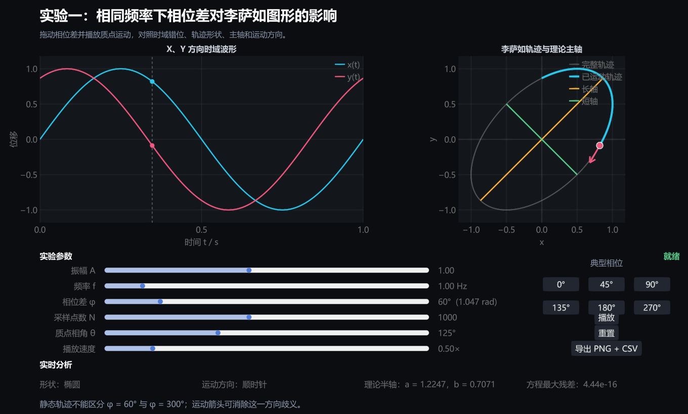

# 实验一：相同频率下相位差对李萨如图形的影响

## 一、方案概述

本方案使用 Julia 1.10 和 GLMakie 构建交互式桌面实验。学生通过调节两个同频、同振幅正交简谐运动的相位差，连续观察时域波形与李萨如轨迹的同步变化，并利用理论主轴、运动箭头和数值残差检验分析结果。

程序文件为 [`run.jl`](run.jl)，项目依赖记录在 [`Project.toml`](Project.toml) 中。第一次启动会自动安装本目录所需的 Julia 包，后续运行将直接复用本地环境。



## 二、实验目标

1. 理解相位差对两个正交简谐运动合成轨迹的影响。
2. 掌握直线、椭圆和圆三类轨迹的形成条件。
3. 将时域波形的水平错位与二维轨迹形状建立对应关系。
4. 测量并比较椭圆长短半轴的理论值和图示结果。
5. 理解静态轨迹的相位分支歧义，并利用运动方向加以区分。
6. 观察采样点数对离散轨迹平滑程度和方程残差的影响。

## 三、物理模型

两个相互垂直的同频、同振幅简谐运动为：

$$
x=A\sin(\omega t)
$$

$$
y=A\sin(\omega t+\varphi)
$$

消去时间得到：

$$
x^2+y^2-2xy\cos\varphi=A^2\sin^2\varphi
$$

程序还将单位圆通过线性映射变换为李萨如椭圆：

$$
\begin{bmatrix}
x\\y
\end{bmatrix}
=
A
\begin{bmatrix}
1&0\\
\cos\varphi&\sin\varphi
\end{bmatrix}
\begin{bmatrix}
\sin\omega t\\
\cos\omega t
\end{bmatrix}
$$

对映射矩阵进行奇异值分解，可直接得到椭圆的主轴方向和两个半轴长度。对于相同振幅的情况，半轴长度也可写成：

$$
a=\sqrt{2}A\max\left(\left|\cos\frac{\varphi}{2}\right|,\left|\sin\frac{\varphi}{2}\right|\right)
$$

$$
b=\sqrt{2}A\min\left(\left|\cos\frac{\varphi}{2}\right|,\left|\sin\frac{\varphi}{2}\right|\right)
$$

## 四、软件与运行环境

- Julia 1.10 或更高的 1.x 版本；
- 支持 OpenGL 3.3 的显卡及驱动；
- Windows、Linux 或 macOS 桌面环境；
- 第一次运行时需要网络连接，以安装 GLMakie。

在本方案目录中执行：

```powershell
julia --project=. run.jl
```

程序会显示依赖安装或预编译信息。首次启动可能需要数分钟；窗口出现后即可断网使用。

只检查物理模型而不打开窗口：

```powershell
julia --project=. run.jl --self-test
```

如果依赖已经安装，希望跳过依赖检查：

```powershell
julia --project=. run.jl --no-instantiate
```

## 五、界面组成

界面分为五个区域：

| 区域 | 内容 | 观察重点 |
|---|---|---|
| 时域波形 | 同一周期内的 x(t)、y(t) 和当前时刻 | 两个波形的水平错位及极值先后 |
| 李萨如轨迹 | 完整轨迹、已运动轨迹、当前质点和方向箭头 | 形状、倾斜方向和绕行方向 |
| 理论主轴 | 长轴和短轴叠加线 | 相位变化导致的轴长交换 |
| 参数控制 | A、f、φ、采样点数、质点相角和速度 | 控制变量并复现实验条件 |
| 实时分析 | 图形类型、运动方向、半轴和方程残差 | 理论与数值结果的对应 |

“典型相位”按钮可以快速切换到 0°、45°、90°、135°、180° 和 270°。“播放”用于观察质点运动；“重置”恢复初始状态；“导出 PNG + CSV”将当前界面和一周期数据写入 `output` 子目录。

参数更新或文件导出时，界面右侧会显示“正在计算...”或“正在导出...”，完成后恢复为结果状态。

## 六、实验变量

### 自变量

相位差 φ，推荐在 0° 至 360° 范围内调节。

### 控制变量

- 振幅：A = 1.00；
- 频率：f = 1.00 Hz；
- 采样点数：N = 1000；
- 两个方向的频率和振幅始终相同。

### 因变量

- 轨迹类型；
- 长半轴 a 与短半轴 b；
- 椭圆主轴方向；
- 质点运动方向；
- 隐式椭圆方程的最大数值残差。

## 七、实验步骤

### 任务一：识别特殊轨迹

1. 保持 A = 1.00、f = 1.00 Hz、N = 1000。
2. 依次选择 φ = 0°、90°、180° 和 270°。
3. 记录图形类型、质点运动方向和两个理论半轴。
4. 播放动画，比较 90° 和 270° 的静态圆形与运动方向。
5. 解释为什么同一静态圆形可以对应两个不同的相位差。

预期结果：

| φ | 图形 | 半轴 | 运动特征 |
|---:|---|---|---|
| 0° | y = x | a = √2A，b = 0 | 在线段上往复 |
| 90° | 圆 | a = A，b = A | 顺时针 |
| 180° | y = -x | a = √2A，b = 0 | 在线段上往复 |
| 270° | 圆 | a = A，b = A | 逆时针 |

### 任务二：观察连续形变

1. 从 φ = 0° 开始，以 15° 或 30° 为步长逐渐增加相位差。
2. 对每个相位记录轨迹形状、长半轴、短半轴和倾斜方向。
3. 重点比较 45°、90°、135°、225°、270° 和 315°。
4. 绘制或描述 b/a 随 φ 的变化。
5. 判断长短轴在哪些相位发生交换。

### 任务三：建立时域与轨迹的联系

1. 固定 φ = 45°，拖动“质点相角 θ”滑块。
2. 在时域图中找出 x、y 的当前值和达到极值的先后顺序。
3. 在轨迹图中观察同一时刻的质点位置和速度方向。
4. 改为 φ = 315°，重复上述步骤。
5. 说明波形错位符号与轨迹绕行方向之间的关系。

### 任务四：验证半轴理论

1. 选择 φ = 30°、60°、90°、120° 和 150°。
2. 记录程序给出的 a、b。
3. 使用本方案第三节的理论公式独立计算 a、b。
4. 计算理论值与程序显示值的相对差。
5. 说明为什么 φ 与 360° - φ 具有相同半轴。

### 任务五：研究离散采样

1. 固定 φ = 60°。
2. 将 N 依次设为 200、500、1000 和 2000。
3. 比较轨迹的视觉平滑程度。
4. 记录隐式方程最大残差。
5. 区分“采样点之间连线造成的视觉折线”与“采样点本身不满足理论方程”这两个问题。

## 八、学生记录表

| 序号 | A | f/Hz | φ/° | N | 图形类型 | a | b | b/a | 运动方向 | 最大残差 |
|---:|---:|---:|---:|---:|---|---:|---:|---:|---|---:|
| 1 | 1.00 | 1.00 | 0 | 1000 |  |  |  |  |  |  |
| 2 | 1.00 | 1.00 | 45 | 1000 |  |  |  |  |  |  |
| 3 | 1.00 | 1.00 | 90 | 1000 |  |  |  |  |  |  |
| 4 | 1.00 | 1.00 | 135 | 1000 |  |  |  |  |  |  |
| 5 | 1.00 | 1.00 | 180 | 1000 |  |  |  |  |  |  |
| 6 | 1.00 | 1.00 | 270 | 1000 |  |  |  |  |  |  |

## 九、数据导出与复核

点击“导出 PNG + CSV”后，程序在 `output` 中生成：

- `lissajous_phase_时间戳.png`：包含当前控件和全部图表的实验截图；
- `lissajous_phase_时间戳.csv`：包含 `t_s`、`x`、`y` 和 `theta_rad` 四列的一周期数据。

可以使用导出的 CSV 独立计算：

$$
R_i=x_i^2+y_i^2-2x_iy_i\cos\varphi-A^2\sin^2\varphi
$$

并以 $\max|R_i|$ 检验数值点是否满足理论轨迹方程。

## 十、误差与注意事项

1. 该程序生成的是理想数值信号，浮点残差通常接近机器精度，不等同于真实示波器误差。
2. N 较小时，折线连接会让轨迹呈现多边形外观，但各采样点仍可满足理论方程。
3. φ = 0° 或 180° 时椭圆退化为线段，短轴方向在数值上不具有唯一物理意义。
4. φ = 90° 或 270° 时两个半轴相同，圆的“主轴方向”不唯一。
5. 静态轨迹通常只能确定相位差的绝对几何关系；必须结合运动方向，才能区分 φ 与 360° - φ。
6. GLMakie 需要 OpenGL 3.3。远程桌面或旧显卡环境若无法打开窗口，应先更新显卡驱动。

## 十一、探究题

1. 为什么频率 f 改变时，静态李萨如轨迹不变，而时域图的周期改变？
2. 为什么 φ = 90° 和 φ = 270° 的轨迹相同，但运动方向相反？
3. 哪些相位差对应相同的长短半轴？它们的时域信号有何区别？
4. 仅凭一幅无方向标记的倾斜椭圆，最多能确定哪些相位信息？
5. 若两个方向振幅不相等，主轴是否仍固定在 y = x 或 y = -x 方向？

## 十二、建议评价标准

| 项目 | 分值 | 要求 |
|---|---:|---|
| 控制变量 | 15 | 正确固定同频、同振幅条件 |
| 特殊轨迹 | 20 | 正确说明 0°、90°、180°、270° |
| 连续变化 | 20 | 能解释椭圆形状和主轴随相位变化 |
| 数据处理 | 20 | 正确计算半轴、比值和残差 |
| 方向判别 | 15 | 能用动画区分共轭相位 |
| 误差讨论 | 10 | 能区分数值采样与真实测量误差 |

## 十三、程序结构

`run.jl` 将模型计算和界面逻辑分开：

- `calculate_lab_data`：生成一周期信号、轨迹、半轴和残差；
- `shape_name`：识别直线、圆或椭圆；
- `rotation_name`：由相位差判断运动方向；
- `axis_segments`：构造理论长短轴；
- `direction_arrow`：生成当前位置的速度方向箭头；
- `write_csv`：导出实验数据；
- `build_lab`：建立 GLMakie 控件、图表和联动；
- `run_model_tests`：验证特殊相位和隐式方程。

这种结构便于后续将实验二的振幅比、实验四的频率失谐或实验十三的噪声模型接入同一套界面。
