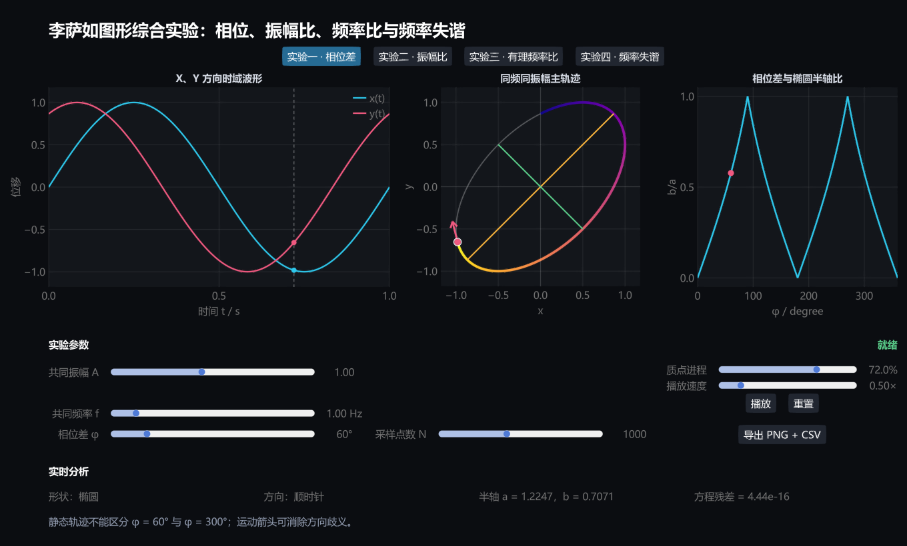

# 李萨如图形综合可视化实验：实验一至四

## 一、方案概述

本方案将“相位差、振幅比、有理频率比、频率失谐”四个实验整合到同一套 Julia + GLMakie 程序中。四个模式共享双通道时域波形、李萨如主轨迹、播放进度、运动方向、采样点数、状态提示和数据导出，并根据当前实验切换专用参数与辅助图。



程序入口为 [`run.jl`](run.jl)，依赖环境由 [`Project.toml`](Project.toml) 和 [`Manifest.toml`](Manifest.toml) 固定。原实验一独立版仍然保留，综合版位于单独目录，不会影响已有实验和链接。

## 二、运行方法

在本目录打开 PowerShell：

```powershell
julia --project=. run.jl
```

首次在其他计算机运行时，程序会自动安装和预编译 GLMakie。依赖已经安装后，可以跳过依赖检查：

```powershell
julia --project=. run.jl --no-instantiate
```

只验证四个物理模型：

```powershell
julia --project=. run.jl --self-test --no-instantiate
```

验证四个模式的界面切换和静态渲染：

```powershell
julia --project=. run.jl --smoke-test --no-instantiate
```

## 三、统一界面

界面包含以下区域：

| 区域 | 统一功能 |
|---|---|
| 顶部模式按钮 | 在实验一、二、三、四之间直接切换 |
| 左侧图 | 显示 X、Y 两个方向的时域波形和当前采样时刻 |
| 中间图 | 显示完整轨迹、彩色运动进程、当前质点和速度方向 |
| 右侧图 | 根据实验切换半轴比、归一化轨迹、闭合距离或相位累积 |
| 参数区 | 显示当前实验需要的参数，隐藏无关参数 |
| 实时分析 | 输出形状、轴长、面积、周期、频率和数值误差 |
| 命令区 | 播放、暂停、重置和导出 PNG/CSV |

参数改变或导出文件时，界面显示“正在计算...”或“正在导出...”。动画进度由统一滑块控制，因此可以暂停并比较任意两个时刻。

## 四、实验一：相位差

### 4.1 模型

$$
x=A\sin(2\pi ft)
$$

$$
y=A\sin(2\pi ft+\varphi)
$$

### 4.2 可调参数

- 共同振幅 A；
- 共同频率 f；
- 相位差 φ；
- 采样点数 N；
- 质点进程和播放速度。

### 4.3 专用显示

右侧绘制椭圆短半轴与长半轴之比 b/a 随 φ 的变化，并标记当前相位。中间轨迹叠加理论长短轴；实时分析给出轨迹类型、运动方向、两个半轴及隐式方程残差。

### 4.4 建议任务

1. 比较 φ = 0°、90°、180°、270°。
2. 观察 b/a 在 0° 至 360° 内的周期变化。
3. 比较 φ 与 360° - φ 的静态轨迹和运动方向。
4. 改变 f，验证静态轨迹不变而时间周期改变。

## 五、实验二：振幅比

### 5.1 模型

$$
x=A\sin(2\pi ft)
$$

$$
y=B\sin(2\pi ft+\varphi)
$$

### 5.2 可调参数

- X 振幅 A；
- Y 振幅 B；
- 共同频率 f；
- 相位差 φ；
- 采样点数 N。

### 5.3 专用显示

中间显示原始轨迹，右侧显示归一化轨迹：

$$
X=\frac{x}{A},\qquad Y=\frac{y}{B}
$$

实时分析给出 B/A、轨迹宽高、椭圆面积和归一化方程残差。椭圆面积理论值为：

$$
S=\pi AB|\sin\varphi|
$$

### 5.4 建议任务

1. 固定 A 和 φ，只改变 B。
2. 比较原始轨迹和归一化轨迹。
3. 验证轨迹宽为 2A、高为 2B。
4. 测量面积随 B/A 和 φ 的变化。

## 六、实验三：有理频率比

### 6.1 模型

$$
f_x=mf_0,\qquad f_y=nf_0
$$

若 m、n 的最大公因数为 g，则约分后的频率比为：

$$
\frac{f_x}{f_y}=\frac{m/g}{n/g}
$$

最短闭合周期为：

$$
T_{\mathrm{close}}
=\frac{m/g}{f_x}
=\frac{n/g}{f_y}
=\frac{1}{gf_0}
$$

当 m、n 互质时，g = 1，因此 $T_{\mathrm{close}}=1/f_0$。

### 6.2 可调参数

- 共同振幅 A；
- 基频 f₀；
- 频率整数 m、n；
- 初相位 φ；
- 闭合进程。

### 6.3 专用显示

程序允许输入未约分的 m:n，并自动显示约分结果。右侧曲线为轨迹到初始点的距离：

$$
d(t)=\sqrt{[x(t)-x(0)]^2+[y(t)-y(0)]^2}
$$

当进程到达 $T_{\mathrm{close}}$ 时，d(t) 回到数值零点。实时分析显示 fx、fy、最短闭合周期和终点闭合误差。

### 6.4 建议任务

1. 比较 1:1、1:2、1:3、2:3、3:4。
2. 输入 2:4，与 1:2 的图形和最短闭合周期比较。
3. 改变初相位，观察形状变化但闭合周期不变。
4. 在闭合进程到达 100% 前暂停，解释图形为何尚未闭合。

## 七、实验四：频率失谐

### 7.1 模型

$$
f_x=f,\qquad f_y=f+\Delta f
$$

$$
\Delta\varphi(t)=2\pi\Delta f\,t+\varphi_0
$$

形状变化周期为：

$$
T_{\mathrm{shape}}=\frac{1}{|\Delta f|}
$$

当 Δf = 0 时，图形稳定，$T_{\mathrm{shape}}$ 记为无穷大。

### 7.2 可调参数

- 共同振幅 A；
- X 方向频率 f；
- 频率差 Δf；
- 初相位 φ₀；
- 形变进程。

### 7.3 专用显示

左侧显示当前时刻附近一个 X 周期的波形，中间显示最近一个周期的动态轨迹，颜色表示轨迹的新旧。右侧显示未折返的相位累积量 $\Delta\varphi/2\pi$；实时分析同时显示折返到 0° 至 360° 范围的等效相位。

### 7.4 建议任务

1. 先令 Δf = 0，确认轨迹稳定。
2. 分别设置正、负 Δf，比较相位累积方向。
3. 测量形状完成一次循环的时间。
4. 验证 |Δf| 加倍时 $T_{\mathrm{shape}}$ 减半。
5. 观察 Δf 符号改变后轨迹变化方向的反转。

## 八、统一实验流程

1. 选择实验模式。
2. 点击“重置”，建立该模式的基准状态。
3. 只改变一个自变量，保持其他参数不变。
4. 使用播放或进程滑块观察形成过程。
5. 读取实时分析值并记录。
6. 点击“导出 PNG + CSV”保存当前结果。
7. 切换模式，比较四种参数对图形的不同作用。

## 九、建议综合记录表

| 模式 | 主要自变量 | 控制变量 | 观察量 | 理论预测 | 程序结果 |
|---|---|---|---|---|---|
| 实验一 | φ | A、f | 形状、a、b、方向 |  |  |
| 实验二 | B/A | f、φ | 宽、高、面积 |  |  |
| 实验三 | m:n | A、f₀、φ | 叶数、Tclose、闭合误差 |  |  |
| 实验四 | Δf | A、f、φ₀ | Tshape、等效相位、变化方向 |  |  |

## 十、数据导出

导出的 PNG 和 CSV 位于 `output` 子目录。文件名包含实验模式和时间戳，例如：

```text
lissajous_lab_ratio_20260730_153000.png
lissajous_lab_ratio_20260730_153000.csv
```

CSV 文件开头记录当前模式和全部输入参数，随后给出 `t_s`、`x`、`y` 三列数据，便于进一步拟合、计算误差或在其他软件中重绘。

## 十一、误差与边界情况

1. 采样点数较少时，曲线连接会出现折线外观。
2. 直线退化情况的短轴方向没有唯一物理意义。
3. 圆形的主轴方向不唯一。
4. m、n 未约分时，必须使用最大公因数求最短闭合周期。
5. Δf 很小时，真实形变周期很长；程序将完整周期映射到统一的形变进程。
6. 实验四显示的是最近一个周期的滚动窗口，因此它反映当前图形状态，而不是无限长时间的全部轨迹。
7. 程序残差主要来自浮点运算，不能代替真实示波器、信号源和传感器的误差分析。

## 十二、程序验证

程序提供两层自动检查：

- `--self-test`：验证特殊相位的圆、振幅归一化、未约分频率比的最短闭合周期和失谐形变周期；
- `--smoke-test`：依次切换四个模式、改变专用参数、移动播放进程并生成界面截图。

四个模式共用统一计算状态和输出格式，后续可以继续接入噪声、阻尼、未知频率测量和声速测量模块。
