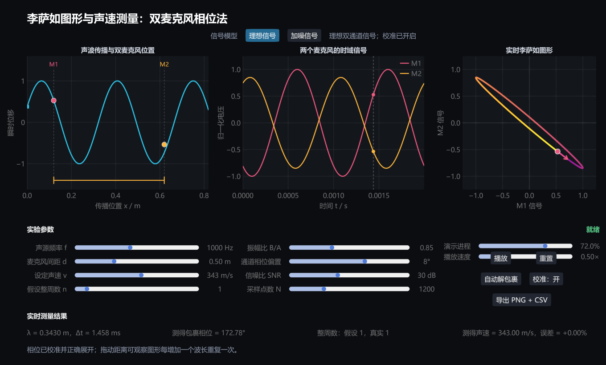

# 李萨如图形与声速测量 Julia 可视化实验方案

## 一、实验概述

本实验使用两个相距已知的虚拟麦克风接收同一正弦声波，将两路信号分别作为示波器 X、Y 输入形成李萨如图形，再由相位差计算空气中的声速。

程序同时展示空间传播、双通道时域信号和李萨如图形，并重点演示实际测量中的三个关键问题：

1. 相位只能在一个周期内测量，存在整数波长数不确定性；
2. 两个采集通道可能带有固有相位偏置，需要校准；
3. 噪声会使理想曲线扩展为点云，并影响相位估计。



## 二、运行方法

在本目录打开 PowerShell：

```powershell
julia --project=. run.jl
```

依赖已经安装后，可以跳过环境检查：

```powershell
julia --project=. run.jl --no-instantiate
```

模型自检：

```powershell
julia --project=. run.jl --self-test --no-instantiate
```

界面和导出检查：

```powershell
julia --project=. run.jl --smoke-test --no-instantiate
```

## 三、物理模型

### 3.1 声波传播

一维正弦声波可表示为：

$$
s(x,t)=A\sin\left[2\pi f\left(t-\frac{x}{v}\right)\right]
$$

其中 f 为频率，v 为声速。两个麦克风位置之差为 d，因此真实传播时间差为：

$$
\Delta t=\frac{d}{v}
$$

真实传播相位差为：

$$
\Delta\varphi_{\mathrm{physical}}
=2\pi f\Delta t
=\frac{2\pi fd}{v}
$$

### 3.2 双通道信号

程序中的两路理想信号为：

$$
x(t)=\sin\left[2\pi f\left(t-\frac{x_1}{v}\right)\right]
$$

$$
y(t)=B\sin\left[2\pi f\left(t-\frac{x_2}{v}\right)-\varphi_{\mathrm{channel}}\right]
$$

其中：

- $x_2-x_1=d$；
- B 为两路信号的振幅比；
- $\varphi_{\mathrm{channel}}$ 为采集通道固有相位偏置。

示波器实际测得的相位同时包含传播相位和仪器相位：

$$
\Delta\varphi_{\mathrm{observed}}
=\Delta\varphi_{\mathrm{physical}}
+\varphi_{\mathrm{channel}}
$$

### 3.3 相位估计

程序不是直接读取理论相位，而是分别将两路采样信号投影到声源频率的复指数基函数：

$$
X_f=\sum_k x(t_k)e^{-i2\pi ft_k}
$$

$$
Y_f=\sum_k y(t_k)e^{-i2\pi ft_k}
$$

测量相位为：

$$
\Delta\varphi_{\mathrm{measured}}
=\arg X_f-\arg Y_f
$$

该方法在加噪模式下仍可得到稳定的主频相位估计。

## 四、李萨如图形

将同一采样时刻的两路信号绘制为：

$$
\bigl(x(t_k),y(t_k)\bigr)
$$

得到李萨如图形。理想情况下：

- 相位差接近 0：正斜率直线；
- 相位差接近 π：负斜率直线；
- 相位差接近 π/2 且振幅相同：圆；
- 其他相位差：椭圆。

颜色表示质点经过轨迹的先后顺序，箭头表示当前运动方向。加噪模式使用点云显示实际采样结果，并用灰色虚线叠加无噪声参考轨迹。

## 五、相位多值性与展开

李萨如图形只能确定 0 至 2π 范围内的包裹相位，但麦克风距离可能包含若干个完整波长：

$$
d=n\lambda+\Delta d
$$

因此总相位应写为：

$$
\Delta\varphi_{\mathrm{total}}
=2\pi n+\Delta\varphi_{\mathrm{wrapped}}
$$

解包裹后的声速估计为：

$$
v_{\mathrm{estimated}}
=\frac{2\pi fd}
{2\pi n+\Delta\varphi_{\mathrm{wrapped}}}
$$

程序提供“假设整周数 n”滑块。若 n 选择错误，即使李萨如图形和包裹相位读取完全正确，也会得到错误声速。“自动解包裹”按钮使用模拟模型中的真实整数周数，便于演示正确结果。

## 六、界面组成

### 6.1 三联画

| 图表 | 显示内容 |
|---|---|
| 声波传播图 | 瞬时空间波形、M1/M2 位置和麦克风间距 |
| 时域信号图 | 两个麦克风信号、当前时刻和幅值 |
| 李萨如图 | 理想曲线或加噪点云、运动进程和方向 |

### 6.2 参数

| 参数 | 作用 |
|---|---|
| 声源频率 f | 决定周期和波长 |
| 麦克风间距 d | 决定传播时间差和相位差 |
| 设定声速 v | 作为模拟环境中的真实声速 |
| 假设整周数 n | 用于相位展开 |
| 振幅比 B/A | 模拟两个麦克风灵敏度不同 |
| 通道相位偏置 | 模拟声卡或传感器固有相位差 |
| SNR | 控制加噪模式中的噪声强度 |
| 采样点数 N | 控制时间和轨迹分辨率 |

### 6.3 命令

- “理想信号/加噪信号”：切换信号模型；
- “播放/暂停”：控制传播动画；
- “重置”：恢复推荐初始参数；
- “自动解包裹”：自动设置正确整数周数；
- “校准：开/关”：决定是否扣除通道相位偏置；
- “导出 PNG + CSV”：保存当前界面和双通道数据。

## 七、实验步骤

### 任务一：理想相位法

1. 选择“理想信号”和“校准：开”。
2. 设置 f = 1000 Hz、d = 0.50 m、v = 343 m/s。
3. 设置 n = 1。
4. 播放动画，观察空间波形、时域错位和李萨如轨迹的同步变化。
5. 记录波长、时间差、包裹相位和测得声速。

### 任务二：验证波长周期性

1. 记录当前李萨如图形。
2. 将距离增加一个波长 λ。
3. 比较增加前后的李萨如图形。
4. 将 n 增加 1，比较声速结果。
5. 解释为什么静态图形重复，但总传播时间并不相同。

### 任务三：错误整周数

1. 保持 d = 0.50 m。
2. 依次设置 n = 0、1、2。
3. 记录三次声速估计。
4. 说明仅凭一幅李萨如图形为什么不能唯一确定声速。

### 任务四：通道校准

1. 设置通道相位偏置为 8°。
2. 关闭校准，记录声速和误差。
3. 开启校准，再次记录结果。
4. 改变偏置的正负和大小，研究系统误差。

### 任务五：噪声影响

1. 选择“加噪信号”。
2. 将 SNR 依次设为 50、30、20、10 dB。
3. 比较时域波形和李萨如点云宽度。
4. 记录复数投影得到的相位和声速误差。
5. 增加采样点数，观察估计稳定性是否改善。

## 八、建议记录表

| f/Hz | d/m | SNR/dB | 通道偏置/° | 假设 n | 真实 n | 包裹相位/° | 测得声速/(m/s) | 相对误差 |
|---:|---:|---:|---:|---:|---:|---:|---:|---:|
| 1000 | 0.50 | 理想 | 8 | 0 | 1 |  |  |  |
| 1000 | 0.50 | 理想 | 8 | 1 | 1 |  |  |  |
| 1000 | 0.50 | 30 | 8 | 1 | 1 |  |  |  |
| 1000 | 0.50 | 15 | 8 | 1 | 1 |  |  |  |

## 九、数据导出

导出文件位于 `output` 子目录：

```text
lissajous_sound_speed_时间戳.png
lissajous_sound_speed_时间戳.csv
```

CSV 文件记录：

- 信号模式和校准状态；
- 所有输入参数；
- 测得相位和声速结果；
- 时间、M1/M2 信号及对应理想信号。

## 十、误差与适用范围

1. 本程序使用合成正弦信号，尚未直接连接真实声卡或麦克风。
2. 相位法对单频稳定信号最直观；宽带脉冲更适合互相关时间差法。
3. 真实房间中的反射声会改变李萨如图形和相位估计。
4. 两个通道必须同步采样。
5. 通道相位偏置应使用同位置麦克风或电学参考信号进行校准。
6. 整数波长数可通过连续移动麦克风、多频测量或时间差粗测解决。
7. 当频率略有差异时，图形会缓慢变化，不再对应固定相位差。

## 十一、自动验证

`--self-test` 验证以下内容：

- 校准后能够恢复设定声速；
- 关闭校准会产生系统误差；
- 麦克风增加一个波长后图形重复；
- 整周数增加后仍能恢复正确声速；
- 加噪信号的相位估计保持有限且接近真值。

`--smoke-test` 还会验证理想/加噪模式切换、校准切换、进程更新、PNG 渲染和 CSV 写出。
